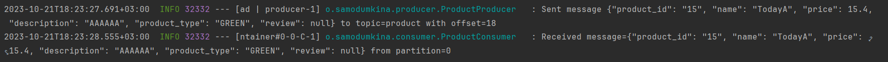

# JABS-Kafka

To use Confluence Cloud you need [create an account](https://www.confluent.io/get-started/). 
Then you [create cluster](https://docs.confluent.io/cloud/current/get-started/index.html) with Kafka topic(s) and schema definition. 
While [configure connector](https://docs.confluent.io/cloud/current/client-apps/connect-w-confluent.html), 
pairs of [credentials](https://docs.confluent.io/cloud/current/client-apps/connect-w-confluent.html#cwc-long-integration-basics) for Kafka and Schema Registry are generated. 

## Set-up

1. Create file `gradle.properties` with definition of Schema Registry credentials.
```console
schemaReqistryUsername=
schemaRegistryPassword=
```
They are used inside [build.gradle](build.gradle) for Schema Registry connection.

2. Create file `env.properties` with definition of next properties:
```console
CONFLUENCE_KAFKA_LOGIN=
CONFLUENCE_KAFKA_PASSWORD=

SCHEMA_REGISTRY_USERNAME=
SCHEMA_REGISTRY_PASSWORD=

CONFLUENCE_BOOTSTRAP_SERVER=
CONFLUENCE_SCHEMA_REGISTRY_URL=
```

First four also are definitions of Confluence Cloud API key. `CONFLUENCE_BOOTSTRAP_SERVER` defines
bootstrap server in cluster, `CONFLUENCE_SCHEMA_REGISTRY_URL` is an url to Schema Registry inside Confluence Cloud Cluster.
This properties are used inside [application.yml](src%2Fmain%2Fresources%2Fapplication.yml).

## How's to
1. To load schemas and their updates

    `gradle downloadSchemasTask`

More options about plugin usage could be found [here](https://docs.confluent.io/cloud/current/client-apps/connect-w-confluent.html#cwc-long-integration-basics).

2. To generate classes from AVRO schemas

    `gradle clean build`
3. Run application as standard Spring Boot Application. 
4. To produce message call endpoint

   `POST http://localhost:8080/api/products`
With example body:
```console
   {
        "id": "15",
        "name": "Name",
        "price": "15.4",
        "description": "Description",
        "productType": "GREEN"
   }
```
5. Consumer log received message.

## Results

Example of producing and consuming message

